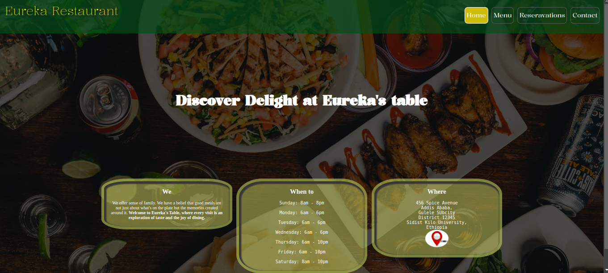

# Eureka-Restaurant
Simple fictional Restaurant Page guided by TOP (The Odin Project)
|Contents                     |
|:---------------------------:|
|[Description](#Description)  |
|[Usage](#Usage)              |
|[Screenshot](#Screenshot)    |
|[Contributing](#Contributing)|
|[Credits](#Credits)          |
|[Contact](#Contact)          |
|[Live Demo](#Live-demo)          |
## Description
- This is my first Page made by using webpack bundler with TOP's guidance.
- The page is fictional restaurant page which is built by prioritizing to the best responsive abilty of mobile screen sizes.
- It is also best fit in wider devices.
- You will not find this page functioning as an ordinary restaurant page since is tailored for just project purpose.

## Usage
- Open up index.html in your preferred browser or to spice things up, get the demo link below. then dwell on it.
- stumble across each nav items to see flips of tabs.

## Screenshot

## Contributing
- It is Okay to make my code dirty.
1. first fork the repository
2. Create new branch for your feature
3. Submit pull request with clear description of your changes

## Credits

- This page utitlizes icons from [iconfinder](https://www.iconfinder.com/) some image assets from [All recipes](https://www.allrecipes.com)
- This Project is stand on the guidance of [TOP](https://www.theodinproject.com/)

## Contact

- Here I am => Email: zakydev8@gmail.com

## Live-demo
[Here](https://zakymaky8.github.io/Eureka-Restaurant/) you go!
